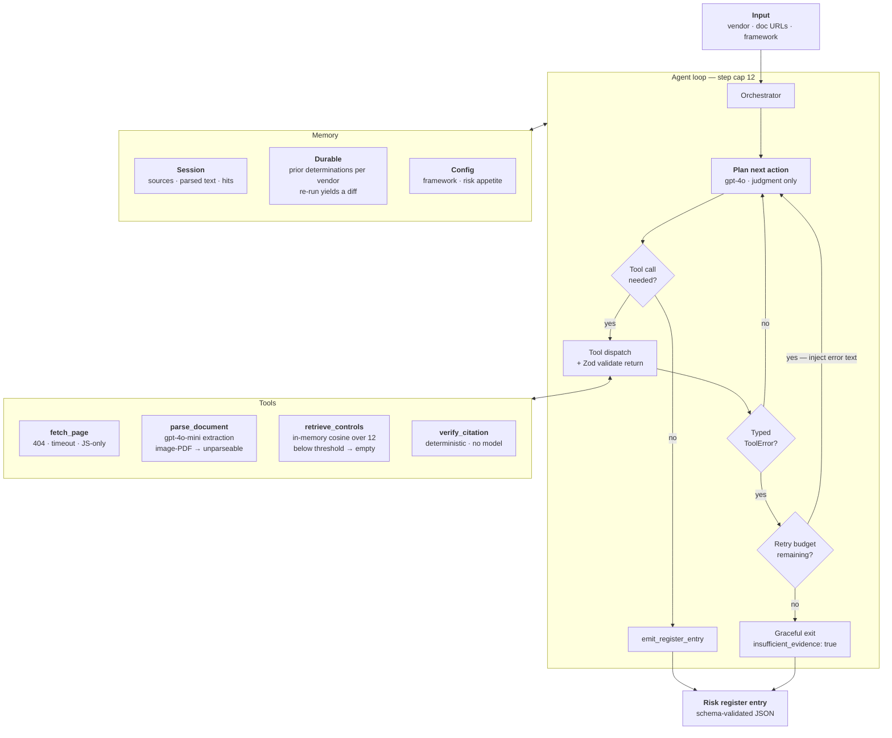

# Sentinel Triage

**Vendor AI Governance Triage Agent** — ingests a vendor's public documentation and emits a citation-backed AI risk-register entry mapped to NIST AI RMF, or abstains when the evidence isn't there.

Capstone build. Axis Sentinel · Carl Scott.

**Live demo:** _(URL after deploy)_ · **Eval history:** [docs/EVAL-HISTORY.md](docs/EVAL-HISTORY.md)

---

## Results

15-case eval suite. Four full runs. One improvement, two documented regressions.

| Run | Headline acc. | Non-trivial acc. | Hallucinated citations |
|---|---|---|---|
| Baseline | 73.5% | 11.5% (3/26) | **0%** |
| Fix 1 — dedup + complete register | 72.7% | **19.2% (5/26)** | **0%** |
| Fix 2 — status rubric *(reverted)* | 68.2% | 11.5% | **0%** |
| Fix 3 — citation gate in code | 71.2% | 7.7% (2/26) | **0%** |

**Read non-trivial accuracy, not headline.** The label set is 80% `no_evidence`, so an
agent that emits `no_evidence` for everything scores **80.3%** — above a naive 80%
target — while doing nothing. Non-trivial accuracy scores only the 26 labels where the
expected status is not `no_evidence`; a null agent scores 0% there.

The agent currently sits **below the null baseline** on mapping accuracy. The root
cause is retrieval recall, not judgment — diagnosed after two fixes aimed at the wrong
layer, both reported. The metric that holds on every run is the hard gate: **zero
hallucinated citations**.

Fix 3 lowered the score and was kept. Reverting it recovers ~11 points by permitting
unverified claims, which is the exact failure this tool exists to prevent.

---

## The one job

> Given one vendor's public documentation, produce a completed, citation-backed AI risk-register entry mapped to one chosen framework — or state that the evidence is insufficient.

One vendor. One framework. One artifact. **Abstention is a successful outcome.**

## The governing rule

Every `met` or `partial` control status requires a verbatim quote traceable to a fetched source. `verify_citation` checks this in **deterministic code, not model judgment**. No verifiable quote → the status downgrades to `no_evidence`.

A wrong control mapping is a draft a human corrects. An invented quote in a compliance artifact is malpractice. That asymmetry is why hallucinated-citation rate is a hard gate at 0% while mapping accuracy targets 80%.

---

## Architecture



### Model routing

| Step | Model | Why |
|---|---|---|
| Plan / control-status judgment | `gpt-4o` | The only step requiring real reasoning over ambiguous control language |
| Document extraction, chunk classification | `gpt-4o-mini` | High token volume, low judgment. ~90% of tokens, ~10% of cost |
| Citation verification | **none** | Deterministic string matching. A model here would defeat the purpose |

### Tool stack

| Tool | Justification (one line) |
|---|---|
| `fetch_page` | Vendor evidence lives on public trust pages; nothing works without retrieval |
| `parse_document` | Trust pages and DPAs arrive as HTML and PDF; the agent needs clean text with source anchors |
| `retrieve_controls` | Maps free-text vendor claims to framework control IDs — the core translation the user can't do quickly |
| `verify_citation` | Turns the 0% hallucination target from a hope into a mechanism |
| `emit_register_entry` | Schema validation is the contract; an unvalidated artifact is worse than none |

**No vector database.** NIST AI RMF v1 scope is ~12 controls — embedded once at build time into a static JSON file, cosine similarity in memory. Infrastructure the project doesn't need is failure surface the project doesn't need.

### Memory & state

| Tier | Contents | Lifetime |
|---|---|---|
| **Session** | Fetched sources, parsed text, retrieval hits for the current run | One invocation |
| **Durable** | Prior determinations keyed by vendor, so a re-run produces a diff ("vendor published a DPA since last review") | Across runs |
| **Config** | Chosen framework, risk appetite, similarity threshold | Per org |

### Failure handling

Every tool returns `Result<T, ToolError>` — never throws. Typed errors, one retry with the error injected into context, then a graceful exit that emits `insufficient_evidence: true` rather than a partial artifact.

| Failure | Handling |
|---|---|
| 404 / timeout / JS-only page | Typed error; agent proceeds with remaining sources and reports partial coverage |
| Image-only PDF | `unparseable` — does not guess at contents |
| Retrieval below similarity threshold | Empty result, which forces `no_evidence` |
| Citation quote not found in source | Assessment rejected, one retry, then status downgraded |
| Schema validation failure | Error injected into context, one retry, then hard fail with typed error |
| Step cap exceeded (12) | Graceful exit with whatever is verified so far |

---

## Status

| Checkpoint | State |
|---|---|
| 1 — Agent Spec | Submitted |
| 2 — Architecture & Tooling | Submitted |
| 3 — Evals & Reliability | Submitted |
| 4 — Ship & Demo | In progress |

## Local development

```bash
npm install
cp .env.example .env.local   # add your key — .env.local is gitignored
npm run dev
```

The API key is read server-side in the API route only. It must never appear in a client bundle.

## Evals

```bash
npm run embed:controls   # embed the NIST control set (run once)
npm run prep:labels      # build labeling worksheets from the source documents
npm run label            # interactive labeler
npm run eval             # full suite -> evals/runs/<timestamp>.md + -entries.json
npm run diagnose -- <id> # single case, label vs actual, side by side
```

`TRACE=1` streams each agent step live. Per-case timeout defaults to 240s.

See [`evals/README.md`](evals/README.md) for the case format and labeling protocol.

## Non-goals (v1)

No legal advice or regulatory applicability rulings · no private or gated documents · no batch runs · no multi-framework comparison in one run · no vendor scoring or ranking · no remediation drafting · no continuous monitoring.


---

## Demo spend guards

The deployed demo runs on a live API key at a public URL, so it accepts **only the
preset vendors** in `src/lib/demo.ts`, rate-limits to 5 runs per IP per hour, and caps
global daily runs. Clone the repo and supply your own key to triage arbitrary URLs.

An unbounded public endpoint backed by a real API key is an open tab on someone else's
account. That lesson was paid for once already on a prior project; it is not being
repaid here.
